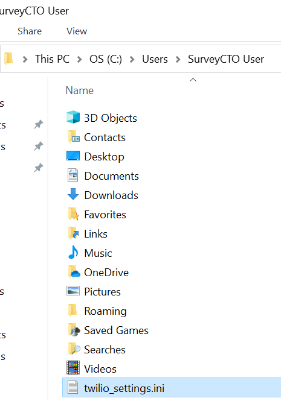

# Twilio audio download

With this script, whenever you use SurveyCTO Desktop to export CSV data, it will also download all call recordings created using the [twilio-call](https://github.com/surveycto/twilio-call/blob/master/README.md) field plug-in.

This script will check all files in the same folder as the ["thenrun" folder](https://docs.surveycto.com/05-exporting-and-publishing-data/02-exporting-data-with-surveycto-desktop/10.outside-processes.html); so, if you are exporting in long format, it will check each of the CSV files that are created (we will explain how to set this up). In those CSV files, the script will check all field names that contain "twilio_call_recordings_url" for URLs to the recordings. For example, it will check fields called "twilio_call_recordings_url", "second_twilio_call_recordings_url", "twilio_call_recordings_url-next", and so on. However, this can be changed in the 'twilio_settings.ini file (see *[Setting up the twilio_settings.ini file](#setting-up-the-twilio_settingsini-file)* below for more info). Capitalization does not matter, so the field "Twilio_Call_Recordings_url-next" will also be checked.

If you run into issues while using this script, see *Troubleshooting* below. If you believe you have found an error with the script, email max@surveycto.com; be sure to send the "recording_log.log" file when you do so.

## Setup

First, click [here](https://github.com/TheOmnimax/twilio-audio-download/raw/master/download-files.zip) to download the ZIP file of the files you will need, and decompress that file. There will be three files in that folder: Two .py files, and one .ini file.

### Setting up Python

This script uses Python 3. To make sure the file will run properly, you will have to make sure the correct application is being used to run it. To check the version of Python that is opened by default, run the file "check-python.py" that is stored in the ZIP file. To learn how to run Python files on Windows and Mac, see *Running Python files on Windows* and *Running Python files on Mac* below, respectively. When you run that file, it will say which version of Python it is running. If it is below Python 3, you will need to associate Python files with Python 3, and possibly install it if needed. Make sure you check if Python 3 is already installed before trying to install it, if applicable.

Note: This script has only been tested on Windows and MacOS. If you would like to use this script on Linux, feel free to fork this repository and make any needed changes. It may already work on Linux, but the error popup (see [Troubleshooting](#troubleshooting)) will only work on Windows and MacOS.

#### Installing Python 3 on Windows

Follow these steps if Python 3 needs to be installed.
1. Open Python 3 in the Windows Store at https://microsoft.com/p/python-38/9mssztt1n39l.
1. On the right, click *Get*. Confirm you would like to open the link in the Windows Store if prompted.
1. Install Python 3.

#### Installing Python 3 on Mac
Python 3 can be installed from [this link](https://www.python.org/downloads/release/python-385/). Download and run the macOS installer.

### Setting up SurveyCTO Desktop

SurveyCTO Desktop should be properly setup by default, but you can follow these steps to be sure:
1. Open SurveyCTO Desktop.
1. On the bottom-left, open *Desktop settings*.
1. On the top, go to *EXPORT OPTIONS*.
1. Checkmark *Auto-run other processors after export.*

To learn more, check our documentation on [automatically executing outside processes](https://docs.surveycto.com/05-exporting-and-publishing-data/02-exporting-data-with-surveycto-desktop/10.outside-processes.html).

### Moving the files

There are two files you need for this script, both of which can be found in the ZIP folder: "twilio-audio-download.py" and "twilio_settings.ini".

#### Moving the twilio_settings.ini file

This file can go in one of two locations: Your user home folder, or in the folder you are exporting to. To find your user home folder on both Windows and Mac, go to the *Users* folder, and open your own user folder. On Windows, the *Users* folder is usually in the `C:\` drive, and on Mac, this is usually in the "Macintosh HD" drive.

Note: If there is a twilio_settings.ini file in both locations, the user home folder will be checked first.

#### Moving the twilio-audio-download.py file

This file must go in the folder you are exporting your data to, inside a "thenrun" folder.
1. Navigate to the folder where you will be exporting your CSV data to.
1. In that same folder, create a new folder called "thenrun", and then open that folder.
1. Move the "twilio-audio-download.py" file to that "thenrun" folder.

### Setting up the twilio_settings.ini file

The "twilio_settings.ini file" file needs to be changed depending on your setup. To change it, open it in a text editor such as Notepad.

Below are details about the twilio_settings.ini file. Enter the needed information so the script can run well. For an example, check out [this template](https://github.com/TheOmnimax/twilio-audio-download/blob/master/source/twilio_settings.ini.template).

#### key

**path**: Full path to the private key on your computer used to decrypt your files. This usually ends in *.pem*. If your call recordings are not encrypted, you can leave this blank. It is a good idea to remove the example path .ini file, so you do not get any unnecessary warnings.

#### file

**field_name**: What the field names need to be contained to be searched for recording information. If not defined, defaults to `twilio_call_recordings_url`.

#### twilio
This is information about your Twilio account. Be careful with this data, since these are the credentials used to access call recordings. You can access your account SID and auth token from your [Twilio console](https://www.twilio.com/console).

#### recording
**location**: Where the recordings will be exported to. If this is left blank, a folder will be created in the export folder called "Call recordings", and the files will be exported there. If the specified folder does not exist, it will be created.  
**format**: Format of the downloaded recordings. This can be either `wav` or `mp3`. Note: Encrypted recordings can only be downloaded in .wav format; if `mp3` is specified, unencrypted recordings will be downloaded in .mp3 format, but encrypted recordings will be downloaded in .wav format.  

## Running Python files on Windows

To run the Python file on Windows, you will need to associate Python files with an application that runs Python 3.

To check your default Python application, open the *check-python.py* file in the ZIP folder. One of the following situations will occur:

**A popup appears stating the Python 3 or above is installed**: Click *OK*, and you are all set. (Python 3.8, 3.7.4, and other versions of Python 3 will work well.)

**A popup appears stating a version of Python 2 is installed**:
1. Click *OK*.
1. Right-click the *check-python.py* file, hover over *Open with*, and click *Choose another app*.
1. Click Python 3 (Python 3.8, 3.7.4, and other versions of Python 3 will work well), select the checkbox for *Always use this app to open .py files*, and click *OK*. If Python 3 is not listed as an option, install Python 3 (see *Installing Python 3 on Windows* above), then go back to step 2.
1. Double-click the *check-python.py* file again to make sure you were successful.

**You are prompted about which application to use**: Select Python 3 (Python 3.8, 3.7.4, and other versions of Python 3 will work well). If Python 3 is not listed as an option, install Python 3 (see *Installing Python 3 on Windows* above), then open the Python file again.

**The file is opened in a text editor or another application**: Close that application, then associate Python files with Python 3 (see *A popup appears stating a version of Python 2 is installed* above, starting at step 2).

## Running Python files on Mac

To run the Python files on Mac, simply change the extension of the file from ".py" to ".command" (if you get a warning about changing the extension, click *Use .command*). Then, whenever that file is opened, it will be run as a Python script in the Terminal.

The first time the file is run, you will likely get a popup saying you need permission to run the file.

If you get this popup, perform the following:
1. Right-click the file.
1. Hold the *Option* key on your keyboard.
1. Click *Copy twilio-audio-download.py.command as Pathname*. You can then let go of the *Option* key.
1. Open a Terminal window. To do so, run a Mac search (shortcut `Cmd + space`), then search for and open "Terminal".
1. Type `chmod u+x '` (with the space and single-quote at the end), but do not press *Return* yet.
1. Paste (shortcut `Cmd + v`) in the path name you had copied. Then enter a single quote `'`. Here is an example:
<pre><code>chmod u+x '/Users/username/Documents/Data exports/thenrun/twilio-audio-download.command'</code></pre>
7. Press *Return* on your keyboard.
8. Close the Terminal window.

Something that may happen is that a MacOS terminal window will open each time you run the script. You can close this yourself each time, but you can also set it to close automatically:
1. Open the Terminal.
1. On the top-left of the screen, click *Terminal*, then *Preferences* (you can also use the shortcut `Cmd + ,`).
1. On the top of the window that appears, go to *Profiles*.
1. On the tab that opens, click *Shell* in the middle.
1. For the dropdown under *When the shell exits*, select *Close if the shell exited cleanly*. It will save automatically.
1. You can now close that window and the Terminal.

## Troubleshooting
If there is an error during the script , a popup will appear, stating that there is an error. If this happens, go to the folder where the data is being exported to, and open the "recording_log.log" file. This will give you details about what happened, and what went wrong (time stamps are given in UTC, not local time).

If that file has not been created, check to make sure "thenrun" is turned on in SurveyCTO Desktop, and that Python files are set to be opened using Python 3. If you are still having trouble, paid users can [create a ticket](https://support.surveycto.com/hc/en-us/requests) with SurveyCTO support. All users can also post to the [community forums](https://support.surveycto.com/hc/en-us/community/topics/200604277-Advice-hacks-and-questions-about-using-SurveyCTO).

## Audio file names

The audio files will have the following format for their names:

1. Start with the unique identifier of the form instance after the "uuid:" part
1. Whatever comes after came after "twilio_call_recordings_url" in the original field name (or whatever the value of "field_name" is in the twilio_settings.ini file). For example, If the field name is "the_twilio_call_recordings_url_here", then the extracted part will be "_here".
1. Underscore `_`
1. The group number
1. `-decrypted` if that recording was previously encrypted.
1. File extention

For example, if the form instance with the unique identifier "uuid:5584c690-5682-4d71-95f4-973d242a1046", and the calls are encypted, the second recording would have this file name:

    5584c690-5682-4d71-95f4-973d242a1046_2-decrypted.wav

In addition, if the file name has already been used by the Python script, then it will add a number in parantheses to the file name to differentiate it, like this:

    5584c690-5682-4d71-95f4-973d242a1046_2 (1).wav

## Further reading

If you would like to test this yourself before truly starting data collection with your main form, deploy the [twilio-call](https://github.com/surveycto/twilio-call/blob/master/README.md) sample form onto your server, perform some test calls, and try using this script to download those recordings.

To learn how to set up Twilio encryption, check out their [documentation](https://www.twilio.com/docs/voice/tutorials/voice-recording-encryption). You can also generate your key pair [using SurveyCTO](https://docs.surveycto.com/02-designing-forms/02-additional-topics/06.encrypting.html).