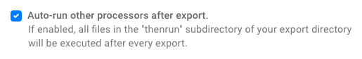
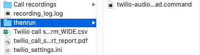
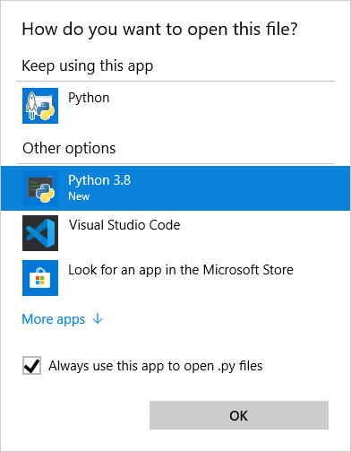
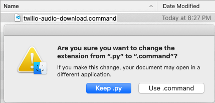
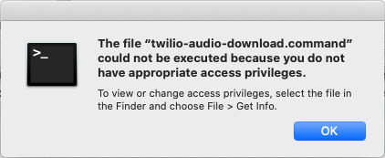
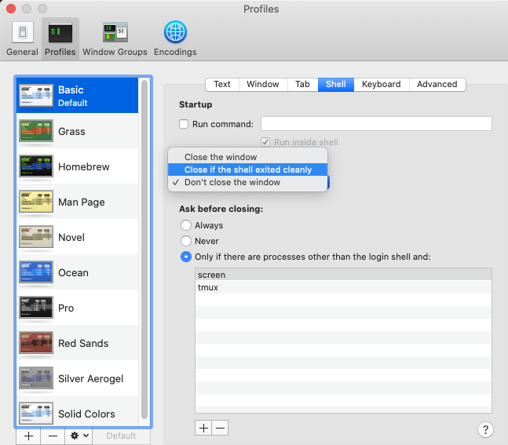

# Twilio audio download

With this script, whenever you use SurveyCTO Desktop to export CSV data, it will also download all calls recorded using the [twilio-call](https://github.com/surveycto/twilio-call/blob/master/README.md) field plug-in.

This script is currently in beta. It has these limitations
* The twilio-call field plug-in can only be used on one field, though that field can be a repeated field.
* It will not work when the twilio-call field plug-in is used in a nested repeated group (i.e. a repeat group within a repeat group).

If you run into issues while using this script, see *Troubleshooting* below. If you believe you have found an error with the script, email max@surveycto.com; be sure to send the "recording_log.log" file when you do so.

## Setup

First, click [here]() to download the ZIP file of the files you will need, and decompress that file. There will be three files in that folder.

### Setting up Python

This script uses Python 3. To make sure the file will run properly, you will have to make sure the correct application is being used to run it. To check the version of Python that is opened by default, run the file "check-python.py" that is stored in the ZIP file. To learn how to run Python files on Windows and Mac, see *Running Python files on Windows* and *Running Python files on Mac* below, respectively. When you run that file, it will say which version of Python it is running. If it is below Python 3, you will need to install it.

#### Installing Python 3 on Windows

Follow these steps if Python 3 needs to be installed.
1. Open Python 3 in the Windows Store at https://microsoft.com/p/python-38/9mssztt1n39l.
1. On the right, click *Get*. Confirm you would like to open the link in the Windows Store if prompted.
1. Install Python 3.

#### Installing Python 3 on Mac
Python 3 can be installed from [this link](https://www.python.org/downloads/release/python-385/). Download and run the macOS installer.

### Setting up SurveyCTO Desktop

SurveyCTO Desktop should be properly setup by default, but you can follow these steps to be sure:
1. Open SurveyCTO Desktop.
1. On the bottom-left, open *Desktop settings*.
1. On the top, go to *EXPORT OPTIONS*.
1. Checkmark *Auto-run other processors after export.*

To learn more, check our documentation on [automatically executing outside processes](https://docs.surveycto.com/05-exporting-and-publishing-data/02-exporting-data-with-surveycto-desktop/10.outside-processes.html).

### Moving the files

There are two files you need for this script, both of which can be found in the ZIP folder: "twilio-audio-download.py" and "twilio_settings.ini".

1. Navigate to the folder where you will be exporting your CSV data to.
1. Move the "twilio_settings.ini" file to that folder.
1. In that same folder, create a new folder called "thenrun", and then open that folder.
1. Move the "twilio-audio-download.py" file to that "thenrun" folder.

### Setting up the twilio_settings.ini file

The "twilio_settings.ini file" file needs to be changed depending on your setup. To change it, open it in a text editor such as Notepad.

Below are details about the twilio_settings.ini file. Enter the needed information so the script can run well. For an example, check out [this template](https://github.com/TheOmnimax/twilio-audio-download/blob/master/source/twilio_settings.ini.template).

#### key
**path**: Full path to the private key on your computer used to decrypt your files. This usually ends in *.pem*. If your call recordings are not encrypted, you can leave this blank.

#### file
This is information about the CSV data file that will be used to retrieve the paths to the audio files.

**form_title**: The title of the form. Make sure you are using the form title, not the form ID, since the form title is used in the CSV file name.  
**rg_name**: Short for "repeat group name". If the Twilio call field is a repeated field, enter the name of the repeated field. If it is in a nested repeat group, enter the name of the top-level repeat group only.  
**format**: Whether the data is being exported in `long` or `wide` format. If left blank, it will assume the data is being exported in long format.  
**add_group_name**: Whether the group name is going to be added to the field name. To check this, in SurveyCTO Desktop, go to *Desktop settings* on the bottom-left, then *EXPORT OPTIONS*, and check *Treatment of enclosing groups in exports*. If *Add groups to exported field names* is selected, make this property `True`. Otherwise, it can be left blank.  
**field**: The name of the field that uses the Twilio field plug-in

#### twilio
This is information about your Twilio account. Be careful about this data, since these are the credentials used to access call recordings. You can access your account SID and auth token from your [Twilio console](https://www.twilio.com/console).

#### recording
**location**: Where the recordings will be exported to. If this is left blank, a folder will be created in the export folder called "Call recordings", and the files will be exported there. If the specified folder does not exist, it will be created.  
**format**: Format of the downloaded recordings. This can be either `wav` or `mp3`. Note: Encrypted recordings can only be downloaded in .wav format; if `mp3` is specified, unencrypted recordings will be downloaded in .mp3 format, but encrypted recordings will be downloaded in .wav format.  

## Running Python files on Windows

To run the Python file on Windows, you will need to associate Python files with an application that runs Python 3.

To check your default Python application, open the *check-python.py* file in the ZIP folder. One of the following situations will occur:

**A popup appears stating the Python 3 or above is installed**: Click *OK*, and you are all set. (Python 3.8, 3.7.4, and other versions of Python 3 will work well.)

**A popup appears stating a version of Python 2 is installed**:
1. Click *OK*.
1. Right-click the *check-python.py* file, hover over *Open with*, and click *Choose another app*.
1. Click Python 3 (Python 3.8, 3.7.4, and other versions of Python 3 will work well), checkmark *Always use this app to open .py files*, and click *OK*. If Python 3 is not listed as an option, install Python 3 (see *Installing Python 3 on Windows* above), then go back to step 2.
1. Double-click the *check-python.py* file again to make sure you were successful.

**You are prompted about which application to use**: Select Python 3 (Python 3.8, 3.7.4, and other versions of Python 3 will work well). If Python 3 is not listed as an option, install Python 3 (see *Installing Python 3 on Windows* above), then open the Python file again.

## Running Python files on Mac

To run the Python files on Mac, simply change the extension of the file from ".py" to ".command" (if you get a warning about changing the extension, click *Use .command*). Then, whenever that file is opened, it will be run as a Python script in the Terminal.

The first time the file is run, you will likely get a popup saying you need permission to run the file.

If you get this popup, perform the following:
1. Right-click the file.
1. Hold the *Option* key on your keyboard.
1. Click *Copy twilio-audio-download.py.command as Pathname*. You can then let go of the *Option* key.
1. Open a Terminal window. To do so, run a Mac search (shortcut `Cmd + space`), then search for and open "Terminal".
1. Type `chmod u+x '` (with the space and single-quote at the end), but do not press *Return* yet.
1. Paste (shortcut `Cmd + v`) in the path name you had copied. Then enter a single quote `'`. Here is an example:
<pre><code>chmod u+x '/Users/username/Documents/Data exports/thenrun/twilio-audio-download.command'</code></pre>
7. Press *Return* on your keyboard.
1. Close the Terminal window.

Something that may happen is that a MacOS terminal window will open each time you run the script. You can close this yourself each time, but you can also set it to close automatically:
1. Open the Terminal.
1. On the top-left of the screen, click *Terminal*, then *Preferences* (you can also use the shortcut `Cmd + ,`).
1. On the top of the window that appears, go to *Profiles*.
1. On the tab that opens, click *Shell* in the middle.
1. For the dropdown under *When the shell exits*, select *Close if the shell exited cleanly*. It will save automatically.
1. You can now close that window and the Terminal.

## Troubleshooting
If the recordings are not being created, go to the folder where the data is being exported to, and open the "recording_log.log" file. This will give you details about what happened, and what went wrong (time stamps are given in UTC, not local time).

If that file has not been created, check to make sure "thenrun" is turned on in SurveyCTO Desktop, and that Python files are set to be opened using Python 3. If you are still having trouble, paid users can [create a ticket](https://support.surveycto.com/hc/en-us/requests) with SurveyCTO support. All users can also post to the [community forums](https://support.surveycto.com/hc/en-us/community/topics/200604277-Advice-hacks-and-questions-about-using-SurveyCTO).

## Further reading

If you would like to test this yourself, deploy the [twilio-call](https://github.com/surveycto/twilio-call/blob/master/README.md) sample form onto your server, perform some test calls, and try using this script to download those recordings.

To learn how to set up Twilio encryption, check out their [documentation](https://www.twilio.com/docs/voice/tutorials/voice-recording-encryption). You can also generate your key pair [using SurveyCTO](https://docs.surveycto.com/02-designing-forms/02-additional-topics/06.encrypting.html).